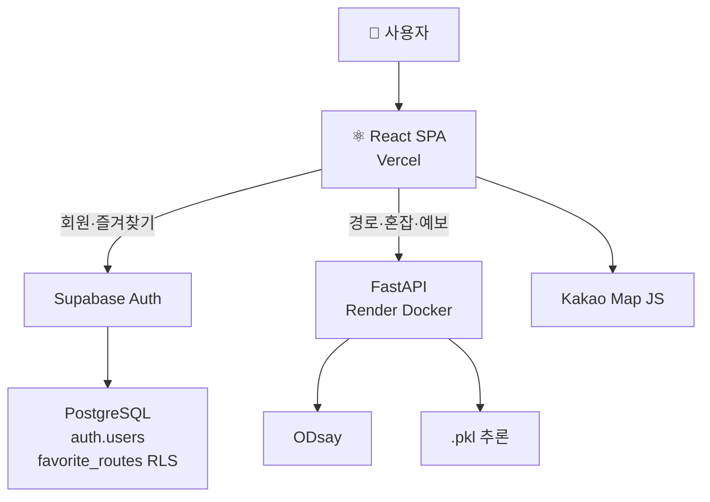

# 여유로 — 서비스 아키텍처 (2026-07-22)

> GitHub `main` · 로컬 `.env` · `render.yaml` · `docs/supabase-setup.md` 기준  
> **모델 학습 과정 제외**, 추론 API·연동만 표기.

**시각화 (택 1):**

| 형식 | 파일 | 열기 |
|------|------|------|
| **Excalidraw** (편집 가능) | [`assets/yeoyuro-architecture.excalidraw`](./assets/yeoyuro-architecture.excalidraw) | VS Code Excalidraw 확장 · [excalidraw.com](https://excalidraw.com) → Open |
| HTML (Simple Icons) | [`architecture-diagram.html`](./architecture-diagram.html) | 브라우저 |
| PNG (슬라이드) | [`assets/yeoyuro-architecture-diagram.png`](./assets/yeoyuro-architecture-diagram.png) | PPT 삽입 |

Excalidraw 재생성: `node scripts/generate-architecture-excalidraw.mjs`

---

## Supabase DB — PostgreSQL

Supabase 프로젝트는 **관계형 DB를 고르는 옵션이 없다**. 항상 **관리형 PostgreSQL**이다.

| 항목 | 내용 |
|------|------|
| DBMS | **PostgreSQL** (Supabase Managed Postgres) |
| Auth 스키마 | `auth.users` — Supabase Auth가 관리 (UUID PK) |
| 앱 스키마 | `public.favorite_routes` — SQL Editor로 생성 |
| PK 타입 | `uuid` (`gen_random_uuid()`) |
| 시각 타입 | `timestamptz` |
| FK | `user_id` → `auth.users(id)` ON DELETE CASCADE |
| 보안 | Row Level Security (RLS) — 본인 행만 SELECT/INSERT/DELETE |
| 클라이언트 | `@supabase/supabase-js` — 프론트에서 **직접** Auth·DB 호출 |
| 활성 조건 | `VITE_SUPABASE_URL` + `VITE_SUPABASE_ANON_KEY` 둘 다 설정 |

**프로젝트 ref (URL):** `zeeetqkqpcahjntbkwbc.supabase.co` (`.env` 기준, 키는 커밋하지 않음)

**Supabase가 하지 않는 것:** ODsay 경로, 혼잡 추론, 정체 예보 → **FastAPI(Render)** 담당

---

## SQLite (로컬 fallback만)

| 항목 | 내용 |
|------|------|
| 위치 | `backend/data/app.db` |
| ORM | SQLAlchemy 2 (`backend/app/models.py`) |
| 테이블 | `users`, `favorite_routes` (INTEGER PK) |
| 사용 시점 | Supabase env **미설정** 시 FastAPI `/auth`, `/favorites` + JWT |
| 운영 | 팀 공용 DB **아님** — Supabase PostgreSQL 사용 |

---

## 전체 아키텍처 (텍스트)

```
[사용자 브라우저]
       │
       ▼
[Vercel] React 19 SPA (Vite · Tailwind · Recharts)
       │
       ├─(VITE_SUPABASE_*)──► [Supabase Auth] ──► [PostgreSQL: favorite_routes]
       │
       ├─(VITE_API_BASE_URL)─► [Render Docker] FastAPI
       │                              ├─ ODsay 프록시 + TTL 캐시
       │                              ├─ POST /predict/route (LightGBM .pkl 추론)
       │                              ├─ GET /forecast (CSV + 공공 API)
       │                              └─ GET /stations/nearby (Kakao REST)
       │
       └─(VITE_KAKAO_MAP_*)──► Kakao Map JS (#macro 실측 지도)

[GitHub Actions] push main → Vercel 원격 빌드
[Render Blueprint] render.yaml → yeoyuro-api (Docker)
```

---

## Mermaid (슬라이드용)



---

## GitHub 저장소 구조 (아키텍처 관련)

| 경로 | 역할 |
|------|------|
| `src/` | React SPA |
| `src/lib/supabase-client.js` | Supabase 클라이언트 |
| `src/lib/api/auth.js` | Supabase ↔ FastAPI JWT 분기 |
| `src/lib/api/favorites-supabase.js` | PostgreSQL `favorite_routes` CRUD |
| `backend/app/` | FastAPI 라우터 |
| `backend/models/*.pkl` | 혼잡 추론 모델 |
| `data/spatic/`, `data/metro-ntce/` | CSV (예보·행사) |
| `render.yaml` | Render 배포 |
| `.github/workflows/deploy.yml` | Vercel CI/CD |
| `docs/supabase-setup.md` | PostgreSQL DDL·OAuth 설정 |

---

## 데이터 저장 위치

| 데이터 | 저장소 |
|--------|--------|
| 회원·즐겨찾기 (운영) | **Supabase PostgreSQL** |
| 회원·즐겨찾기 (fallback) | SQLite `app.db` |
| 혼잡 예측 결과 | API 응답 (DB 미저장) |
| 집회·알림 | CSV + FastAPI 메모리 |
| 모델 가중치 | `backend/models/*.pkl` |

---

## 슬라이드 아이콘 (Simple Icons)

| 요소 | slug |
|------|------|
| React | `react` |
| Vercel | `vercel` |
| Supabase | `supabase` |
| PostgreSQL | `postgresql` |
| ODsay | `odsay` |
| Kakao Map / REST | `kakao` |
| PostgreSQL | `postgresql` |
| 공공데이터 | 특일 · 기상 · 지하철 돌발(ntce) 3노드 |
