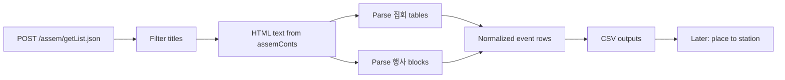

# SPATIC 집회·행사 크롤 → CSV 구현 플랜

## Goal

서울경찰청 교통정보센터 [집회·통제정보](https://www.spatic.go.kr/spatic/main/assem.do)에서 **행사/집회** 게시글을 수집·파싱해, **어디에서 시위·행사가 열리는지**(장소·행진 시작/끝)를 CSV로 정리한다.  
최종 목적은 인근 지하철역 혼잡(시작·끝 지점 몰림) 분석용 피처를 만드는 것이며, **이번 범위는 크롤 + 구조화 CSV까지**다. 역 매핑·혼잡 모델 연동은 후속 Phase.

## Research findings (verified 2026-07-13)

### Board UX vs crawler

| 현상 | 원인 | 크롤러 함의 |
|------|------|-------------|
| 첫 방문 시 목록이 바로 안 보임 | `GmxMainSvc.create()`가 AJAX로 `POST /spatic/assem/getList.json` 호출 후 `tbody.assem_content` 채움 ([`GmxMainSvc.js`](https://www.spatic.go.kr/spatic/res/js/main/svc/GmxMainSvc.js)) | **정적 HTML만 스크랩하면 안 됨**. JSON API를 직접 호출 |
| 위치(geolocation) 권한 요청 | 교통지도/관제 UI용. 게시판 본문과 무관 | **무시**. HTTP 클라이언트는 geo API를 쓰지 않음. Playwright를 쓸 경우에도 grant/deny만 하고 콘텐츠 대기 조건으로 쓰지 않음 |
| 표가 화면에서 깨짐 | 본문이 한글(HWP) 웹에디터 HTML + `<!--[data-hwpjson]...-->`. 렌더러/폰트 이슈 | 복붙 텍스트·HTML 텍스트 추출은 정상. **DOM 스크린샷이 아니라 `assemConts` HTML 텍스트 파싱** |

### Preferred client: plain HTTP (not Playwright)

Playwright는 이미 `devDependencies`에 있으나, 이 작업에는 **불필요·비권장**:

- 목록·본문이 모두 `getList.json` / `getItem.json`에 포함됨
- 도로공사 글의 `assemConts`가 **1MB+**라 브라우저 렌더는 느리고 불안정
- geolocation 프롬프트·지도 스크립트 로딩을 피할 수 있음

**권장:** Node `fetch` 또는 Python `urllib`/`httpx`로 POST. 디버깅용으로만 Playwright(목록 대기 `tbody.assem_content tr`)를 옵션으로 둔다.

### APIs

```
POST https://www.spatic.go.kr/spatic/assem/getList.json
Content-Type: application/x-www-form-urlencoded
Body: limit=10&offset=0
```

응답:

- `count`: 전체 건수 (조사 시점 **1706**)
- `result[]`:
  - `mgrSeq`, `assemTitle`, `lastMdfyDat` (`YYYYMMDDHHmmss`)
  - `assemConts` — **전체 본문 HTML (목록 응답에 이미 포함)**
  - `readCount`, `docType`, `atchFileNm`, …

단건:

```
POST https://www.spatic.go.kr/spatic/assem/getItem.json
Body: mgrSeq=2005
```

상세 페이지 HTML: `/spatic/assem/getInfoView.do?mgrSeq=` (파싱 1순위 아님; API면 충분).

페이지 크기: UI는 `limit=10`. 크롤러는 `limit=20~50`으로 페이지네이션. `offset`를 `count`까지 증가.

### Title filter

| 포함 | 제외 |
|------|------|
| `행사 및 집회`, `집회 및 행사` | `서울시내도로공사` / `서울시내 도로공사`, 제목에 `테스트`/`(테스트)` |

대략 전체의 ~절반이 집회·행사 글.

### Historical depth (중요)

| 기대 | 실제 |
|------|------|
| 작성일 2021년까지 | **불가.** 실데이터 최초 ~ **2024-03-18**. 그 이전은 테스트 글뿐 |

2021–2024초 공백은 SPATIC 보드에 없음. 이번 Phase는 **가용 전체(2024-03~현재) 크롤**로 확정. 2021 보충은 별 소스(공공데이터·Wayback 등) 후속 검토.

### Body shapes (파싱 대상)

1. **□ 집 회** — HTML `<table>` (연번 / 시간 / 장소[및 행진])
2. **□ 행 사** — 자유 텍스트 (`-일시:`, `-코스:`, `-통제구간:` 또는 `• 일 시:` 등 변형)
3. 장소 셀 안 **【 사전 집회·행진 】** 중첩 표/블록 — **별도 행 + `is_pre_march` 플래그**
4. `※행진:...→...` — 경로·출발시각·거리·차로 수 힌트

샘플로 확인된 장소 예: 시의회 앞, 동화면세점, 사랑채, 파고다타워⇄강남역, 여의도공원, 신촌역/홍대입구역 출구 등.

## Architecture



## Deliverables

| Path | Role |
|------|------|
| `scripts/crawl-spatic-assem.mjs` (또는 `.py`) | 페이지네이션 크롤 + raw JSONL 저장 |
| `scripts/parse-spatic-assem.mjs` | 본문 → 정규화 행 |
| `data/spatic/raw/assem-*.jsonl` | raw (mgrSeq, title, date, conts) |
| `data/spatic/assem-events.csv` | 분석용 flat CSV |
| `data/spatic/assem-posts.csv` | 게시글 단위 메타 (선택) |
| `package.json` script | 예: `"crawl:spatic-assem"` |

앱 UI/`crowd-data.js` 연동은 **이번 Phase 밖**.

## CSV schema (crowding-oriented)

한 행 = 집회 1건, 사전집회 1건, 또는 행사 1건.

| Column | Description |
|--------|-------------|
| `post_id` | `mgrSeq` |
| `post_date` | 게시 작성일 `YYYY-MM-DD` (`lastMdfyDat`) |
| `event_date` | 제목/본문에서 추출한 행사·집회 일자 (제목 `7월 13일` + year from `lastMdfyDat`) |
| `post_title` | 원제목 |
| `record_type` | `assembly` \| `pre_march` \| `event` |
| `seq_no` | 집회 연번 (행사면 빈칸) |
| `time_raw` | 원문 시간 (`①08:40∼09:00` / `13:00∼` 등) |
| `time_start` / `time_end` | 파싱된 `HH:MM` (불명확하면 빈칸) |
| `place_raw` | 장소 원문 |
| `place_primary` | 주 집결/고정 장소 (행진 화살표 앞쪽 또는 단일 장소) |
| `march_raw` | `※행진:` 원문 |
| `march_start` / `march_end` | 행진 시작·끝 토큰 (`→`/`⇄` 분할) |
| `march_waypoints` | 중간 경유 `|` 구분 (선택) |
| `is_pre_march` | `true`/`false` — 【사전 집회·행진】 |
| `parent_seq_no` | 사전집회가 속한 본집회 연번 |
| `event_name` | 행사명 (`[2026 서울시 …]` 등) |
| `control_time_raw` | 교통통제 시간 원문 |
| `control_section_raw` | 통제구간/코스 원문 |
| `crowd_focus_points` | 분석용: `place_primary`, `march_start`, `march_end`를 `;`로 묶은 포인트 목록 |
| `source_url` | `https://www.spatic.go.kr/spatic/assem/getInfoView.do?mgrSeq={id}` |

`crowd_focus_points`가 “사람들이 어디서 몰리냐” 1차 키. 후속에서 역명/좌표 매핑.

## Parsing rules (concrete)

1. `assemConts`에서 script/style·`data-hwpjson` 주석 제거 후 태그 → 텍스트 (`table`/`tr`/`td`는 줄·탭 유지). BeautifulSoup/cheerio 또는 단순 HTMLParser.
2. `□ 행 사` ~ 다음 `□` 전까지를 행사 블록. 행사명 + `일시|일 시|행사일시`, `코스|코 스`, `통제구간|통제장소|통제일시` 라인 정규식.
3. `□ 집 회` 아래 표: 헤더행 스킵, 연번이 숫자인 행 = 본집회. 셀에 `【 사전 집회·행진 】`이 있으면 다음 ①/② 행을 `record_type=pre_march`, `parent_seq_no` 연결.
4. `※행진:` 또는 `※ 행진` → `march_*`. `→` 시퀀스의 첫/끝 토큰을 start/end. `⇄`는 왕복으로 start/end 양방향 표기.
5. 파싱 실패 행은 `parse_ok=false` + `place_raw`/`time_raw`만 남기고 raw JSONL에 본문 보존 (재파싱 가능).

## Implementation phases

### Phase 1 — Crawler + raw dump

- `getList.json` 페이지네이션 (`limit=20`, `offset` += limit until empty / `offset >= count`)
- 제목 필터, 테스트 글 제외
- rate limit ~200–500ms, User-Agent + Referer
- 출력: `data/spatic/raw/assem.jsonl` (+ 선택적으로 conts 제외 메타만 두는 slim 파일 — 도로공사 미수집이므로 용량 관리 용이)
- 재실행 시 `mgrSeq` 기준 resume/skip

### Phase 2 — Parser → CSV

- 위 스키마로 `assem-events.csv` (UTF-8 BOM 선택 — Excel)
- 샘플 10건 수동 검수 (집회만 / 행사+집회 / 사전행진 중첩 / 행진 ※ / 다중 행사)
- 파싱 커버리지 리포트 (성공률, 빈 `place_primary` 비율)

### Phase 3 — (후속, 이번 PR 밖) 장소 → 역

- `crowd_focus_points` 토큰을 기존 [`src/lib/seoul-metro-stations.js`](../src/lib/seoul-metro-stations.js) / 역명 사전과 매칭
- 출구 표기(`홍대입구역 7出`) 정규화
- 일별·역별 집회 건수 CSV → mock `TODAY_EVENTS` / 혼잡 보정 실험

## Constraints & non-goals

- **2021년까지 SPATIC만으로 채우기: 불가** → 문서·README에 데이터 기간 `2024-03 ~` 명시
- 도로공사 본문 미수집
- 지도 좌표·실시간 돌발 API(`ItsIncidentInfo`) 이번 범위 밖 (실시간 보완용으로만 메모)
- 프론트 UI 변경 없음
- 사이트 ToS/과도한 트래픽 주의: 순차 요청, 캐시된 raw 재파싱 우선

## Verification

1. `count`와 수집 `mgrSeq` 수 일치(필터 전) / 집회·행사만 필터 후 건수 로그
2. 알려진 샘플과 CSV 행 대조:
   - 2026-07-13 집회: 시의회 앞, 정곡빌딩
   - 2026-07-12 행사: 쉬엄쉬엄 모닝 코스 + 집회 행
   - 2026-07-07/04: `is_pre_march=true` 행 존재
3. CSV를 열어 `crowd_focus_points`에 역·지명 토큰이 비지 않는지 스팟 체크
4. Playwright **없이** 스크립트만으로 end-to-end 재현

## Decision summary

- **수집 방식:** Playwright/정적 HTML이 아니라 **`POST /assem/getList.json`**
- **Geolocation:** 무시 (보드 데이터와 무관)
- **기간:** 요청 2021~ 불가 → **보드 가용 전체(2024-03-18~)** 크롤
- **행 단위:** 집회 / 사전집회·행진 / 행사를 한 CSV에 `record_type`으로 구분
- **핵심 컬럼:** 장소·행진 시작/끝 → `crowd_focus_points` (역 혼잡 분석 입력)
