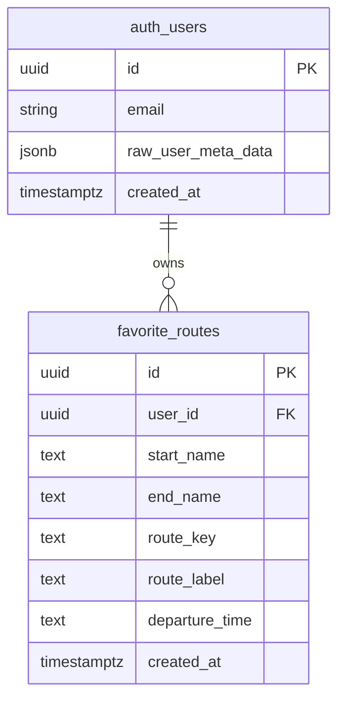
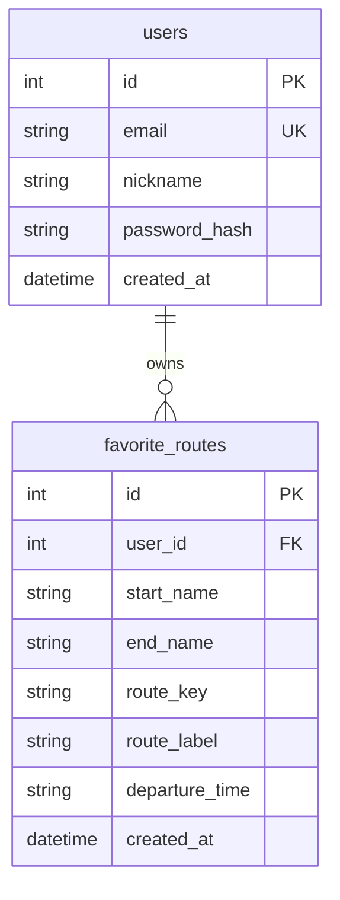
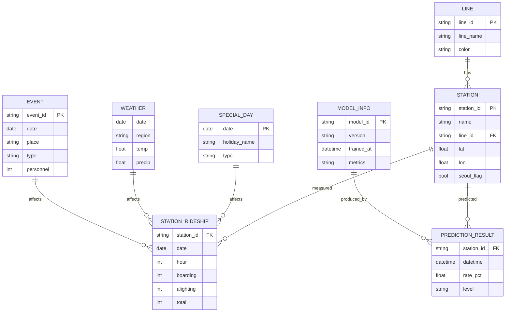

# 여유로 — ERD

작성일: 2026-07-22 (Supabase PostgreSQL 반영) · 팀: J1L4

## 범례

| 구분 | 의미 |
|------|------|
| **물리 (운영)** | Supabase **PostgreSQL** — 팀 공용 (`VITE_SUPABASE_*` 설정 시) |
| **물리 (fallback)** | FastAPI **SQLite** — Supabase 미설정 시 로컬만 |
| **논리** | CSV·파일·추론 결과로 다루며, 문서상 관계로 표현 |

---

## 1. 물리 ERD — Supabase PostgreSQL (운영 기준)

Supabase = **관리형 PostgreSQL**. 별도 RDBMS 선택 없음.

- 스키마: `auth.users` (Supabase Auth) · `public.favorite_routes` (앱)
- Unique: `(user_id, start_name, end_name, route_key, departure_time)`
- RLS: `auth.uid() = user_id` — 본인 행만 CRUD
- UI 제약: 사용자당 즐겨찾기 **최대 5건**
- `departure_time`: `HH:MM` 문자열, 재조회 시 날짜는 당일 기준

코드: [`docs/supabase-setup.md`](../supabase-setup.md) · [`src/lib/api/favorites-supabase.js`](../../src/lib/api/favorites-supabase.js)

---

## 1-b. 물리 ERD — SQLite (로컬 fallback)

Supabase env 없을 때만 FastAPI JWT + SQLite.

코드: [`backend/app/models.py`](../../backend/app/models.py)

---

## 2. 논리 ERD (데이터·예측)

학습·피처·추론에 쓰이는 개념 모델. 물리 FK로 강제되지 않을 수 있음.

### 런타임 연결 (문서)

| 외부/서비스 | 논리 엔티티와의 관계 |
|-------------|----------------------|
| ODsay 경로 | `STATION` 이름·좌표로 OD 매칭 → 경로 세그먼트 |
| LightGBM `*.pkl` | `MODEL_INFO` + `PREDICTION_RESULT` |
| `/forecast` | `SPECIAL_DAY` + `WEATHER` + `EVENT`(SPATIC/ntce) |
| Kakao Local | 주변 `STATION` 조회 |

---

## 3. 혼잡 등급 (표시용)

| level | 표시 | rate 기준(역사) |
|-------|------|-----------------|
| RELAXED | 여유 | &lt; 30% |
| NORMAL | 보통 | 30–59% |
| BUSY | 혼잡 | 60–79% |
| VERY_BUSY | 매우혼잡 | 80–99% |
| EXTREME | 극혼잡 | ≥ 100% |

코드: `src/lib/congestion.js`, `backend/app/schemas.py`
